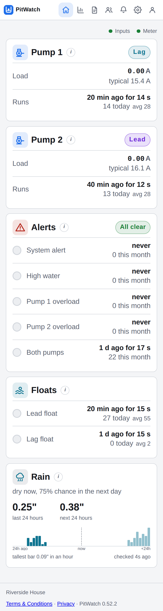
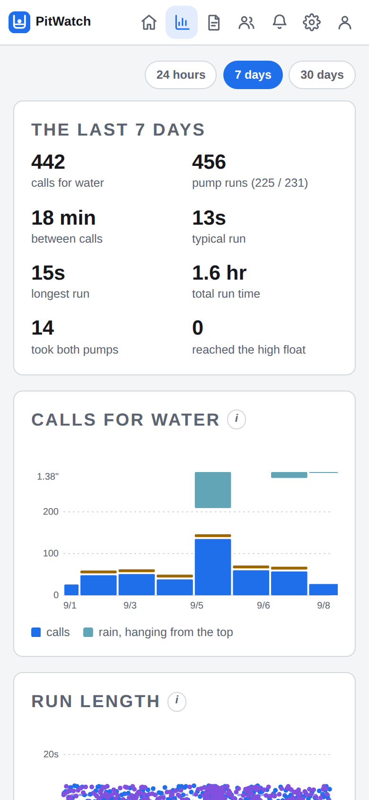
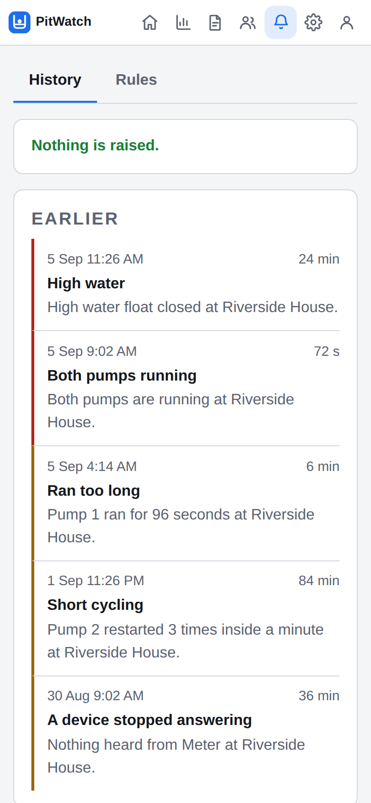

# PitWatch

Monitoring and real alerting for a duplex ejector pump panel.

Most pump controllers have one alarm contact and one thing to say with it:
something is wrong. Not which pump, not how wrong, not whether it has happened
before. PitWatch reads the same panel with a pair of current clamps and an
Ethernet I/O module, and turns that one contact into a page that says *pump 2
has been drawing 14.2 A for four minutes, the high water float is wet, and both
pumps are running*.

| The pit now | A week of it | What was raised |
| --- | --- | --- |
|  |  |  |

Made up numbers on a demo install. The wet day on the middle chart is the point
of the whole thing: rain hangs from the ceiling and the calls for water sit
underneath it.

## What it does

- **Reads both motors continuously** and keeps every reading, so a pump drawing
  more than it did last month is something you can see rather than guess.
- **Counts what the panel actually did** from its own run contacts. A run is a
  contact closing, so the count is a tally and the duration is a measurement.
- **A dashboard laid out like the panel**, at a size that reads on a phone in a
  basement: two pumps, the floats, the alarm contact, and what is open now.
- **A history page**: how often the pit calls for water, how long between calls,
  how long a run lasts, what it drew, what time of day it happens, and the rain
  over the top of it.
- **Fifteen alert rules** over email and SMS, raised once per condition and
  cleared when it goes away, with a test button that sends a real message.
- **A written summary**, if you add an OpenAI key. It sends a week of figures and
  the description you wrote, and reads them back as a few paragraphs.

## What you need

1. **A duplex pump panel** with dry contacts for the floats, the run signals and
   the motor overloads. The reference installation is a Magnus controller.
2. **A current meter that publishes over MQTT.** The reference installation uses
   a [Shelly EM Gen3](https://www.shelly.com/products/shelly-em-gen3) with a CT
   clamp on each motor.
3. **An I/O module that publishes over MQTT**, one topic per input. The reference
   installation uses a [ControlByWeb X-408](https://www.controlbyweb.com/x408/):
   eight optically isolated inputs, 4 to 26 V DC, firmware 3.12 or newer.
4. **Somewhere to run Docker.** A NAS, a small server, a Raspberry Pi.

**Nothing is reached into.** Every device dials out to one MQTT broker, which
comes up alongside PitWatch in the same compose file, and publishes when
something changes. So there is no poll interval to choose between a fast alarm
and a busy network, no fixed addresses to keep track of, and no route from the
application back into the panel, which is what lets PitWatch run somewhere other
than the building later without a VPN into it.

The one exception is a clamp, which can ask for a reading while its pump is
running, because a meter that publishes on change says very little during a
steady twelve second run. That still goes out through the same broker.

## Install

```sh
mkdir pitwatch && cd pitwatch
curl -O https://raw.githubusercontent.com/dkmcgowan/pitwatch/main/docker-compose.yml
curl -O https://raw.githubusercontent.com/dkmcgowan/pitwatch/main/.env.example
mv .env.example .env
```

Put a database password and a broker password in `.env`. Those are the only two
settings without a sensible default; the rest are in `docker-compose.yml` with a
comment next to each.

```sh
docker compose up -d
```

Open `http://<your-host>:8080` and sign in as **`admin`** with the password
**`pitwatch`**. It makes you change that before anything else opens, then walks
you through setup.

## What PitWatch listens to

Three kinds of thing, because a pump panel asks three kinds of question, and
each gets its own section on the settings page.

| Kind | The question | What you give it |
| --- | --- | --- |
| **Clamp** | What is the pump drawing? | A topic, and where in the body the number is |
| **Contact** | Is this float wet, is this pump running? | One topic per input, and whether it is on when voltage is present or missing |
| **Health** | Is the thing that would have told us still plugged in? | A topic the device publishes on a schedule, and how often to expect it |

There are no device profiles and nothing in the code knows what a Shelly is. Any
hardware that publishes a number, or an on and an off, to a topic will work.

**Diagnostics**, at the bottom of the settings page, is where you find out
whether it is working: every source you configured, its topic, whether anything
has ever arrived on it and when the last one did.

### The meter

Point it at the broker in its own web page, then fill in the topics on the
PitWatch settings page. The reference meter publishes under its own MQTT client
name, `shellyemg3` below, so use whatever yours is set to:

| Field | Value |
| --- | --- |
| Topic | `shellyemg3/status/em1:0` for the first clamp, `em1:1` for the second |
| Reading at | `current` |

A meter that publishes on change says nothing while a motor runs steady, and a
twelve second run can come through as two readings. So a clamp can also **ask**,
once a second, while its pump is running:

| Field | Value |
| --- | --- |
| Ask on | `shellyemg3/rpc` |
| Ask with | `{"id":1,"src":"pitwatch-c1","method":"EM1.GetStatus","params":{"id":0}}` |
| Answer arrives on | `pitwatch-c1/rpc`, matching `src` above |
| Answer at | `result.current` |

Give each clamp its own `src` and its own answer topic. A reply carries no sign
of what it was answering, so two clamps reading one topic would each match every
answer and file one reading under both pumps.

For **health**, use the topic the meter publishes on a clock rather than the one
it publishes on change, and set the interval to match. The reference meter sends
`shellyemg3/status/em1data:0` every 60 seconds.

### The panel inputs

All of this is typed into the module's own web page, under **Setup**, because it
talks to PitWatch and PitWatch never talks to it.

**General Settings**, then the **MQTT** tab. Add a broker: the IP address of the
machine running PitWatch, `MQTT_PORT` from your `.env`, the user name and
password from there too, keep alive `30`, clean session on.

**Turn the heartbeat on**, topic `pitwatch/heartbeat`, the default 60 second
interval, **Prepend Topic Root off**, and put that topic in the health section of
the settings page with 60 seconds beside it. Proof of life is that something
arrived, not what it said, and about two and a half missed intervals of silence
marks the device offline.

Set a last will if you like, but PitWatch does not read one. A will only reaches
whoever is subscribed at the moment it fires, never fires at all for an outage
shorter than the keep alive, and, measured on the reference meter, published
`offline` one tenth of a second before `online` when the device reconnected: a
session takeover rather than a death notice. Silence is the more honest test.

Then add **eight publications**, one per input:

| Field | What to put |
| --- | --- |
| Publication Name | `inputs1` through `inputs8` |
| Publish on Change | **On** |
| I/O | Digital Input 1, then 2, and so on |
| Publish Interval | leave empty |
| Topic | `pitwatch/inputs/1` through `pitwatch/inputs/8` |
| Payload | `${digitalInput1}` through `${digitalInput8}` |
| QoS, Retain | `1`, On |
| Prepend Topic Root | **Off**, unless the topic is written relative to a root |

One topic per input, because a contact is on or off and that is all a contact
ever is. Retain matters: it is how PitWatch learns where every input is resting
the moment it subscribes, rather than at the next time one moves.

`1`/`0`, `true`/`false`, `on`/`off`, `yes`/`no`, `closed`/`open`, `high`/`low`
and `active`/`inactive` all read, in any case, and so does a bare number. A
device that wraps its state in JSON is read too: put the dotted path to the
value, like `state` or `value.on`, under **Key in body** beside the topic.

The topics also go on the PitWatch settings page and have to match. Nothing warns
you if they do not, because a topic nobody publishes to looks exactly like a
module with nothing to say. That is what Diagnostics is for.

## Wiring the panel inputs

> Turn the panel off first, and if you are not comfortable working inside a pump
> control panel, have an electrician do it. PitWatch only reads; nothing here
> should change how the panel behaves, and if it does, something is wired wrong.

The X-408's inputs want **applied voltage**, 4 to 26 V DC. They do not supply
their own sensing current, so a free dry contact has to switch something. On a
24 V panel that is the control supply it is already sitting next to.

**The eight inputs share four negative terminals, a pair to each.** Inputs 1 and
2 return through one, 3 and 4 the next, and so on. Everything referencing one
control common is fine; it is worth knowing before you plan the wiring.

- **A signal the panel already energizes:** run the line to its input and the
  panel's control common to that input's negative terminal. Use the **panel's**
  common, not the module's own `Gnd`, or the isolation stops isolating anything.
- **A free dry contact:** put it in series between the control supply and its
  input, negative terminal on the control common.

Power the module over **PoE** rather than from the panel. One fed by the panel
goes quiet exactly when the panel loses power, which is one of the things you
want to be told about.

**Which way round is each input?** Lift a float by hand and watch Diagnostics
rather than reasoning about it. Alarm and overload contacts in particular are
often held energized while healthy and drop on the fault, so that a cut wire
reads as a fault; those are the ones to tick **on when voltage is missing**.

## Alerts

Each rule has four things you can set: whether it runs, how loudly, whether it
goes to administrators only, and what it says. Everybody whose own level on the
Users page is at or below the rule's level hears it. The line you write is what a
text says; an email sends the same line and the readings behind it.

Each is raised once and stays open until the condition goes away, so a float that
chatters twenty times sends one message and one all clear.

| Alert | Reads | Default |
| --- | --- | --- |
| High water | contacts | critical |
| Panel alert, unexplained | contacts | critical. Waits a few seconds to see whether something with detail explains it |
| Overload tripped | contacts | critical |
| Switched on, drawing nothing | both | critical. Neither sensor can see this alone |
| Both pumps running | contacts | warning. One could not keep up with the pit |
| Ran too long | contacts | warning, over a minute |
| Short cycling | contacts | warning. Usually a check valve letting the discharge run back |
| Nothing has run | contacts | warning, after six hours |
| A pump has stopped taking its turn | contacts | warning. One works and the other does not |
| A device stopped answering | PitWatch | warning, administrators only |
| Taking longer than it used to | contacts | info. The run getting slower week over week |
| Drawing more than it used to | clamps | info. The steady draw climbing month over month |
| Drawing too much | clamps | off until you set the amps |
| Float activity | contacts | off. Every float, every time |
| A pump started | contacts | off. Every run |

Several cannot fire until the inputs are wired, and the page says which.

## Accounts

Everyone who should be told about a pump is an account on the **Users** page.
Most never sign in; a password is optional, because the reason a superintendent
is in this list is to get a text at two in the morning. Anyone who also wants the
dashboard gets an invitation link. Only administrators can change settings or
manage users.

If this is reachable from the internet, set two things in `docker-compose.yml`:

| Setting | Why |
| --- | --- |
| `PITWATCH_SECURE_COOKIES=true` | Marks the session cookie Secure, so a browser will not send it over plain HTTP. Set it when a proxy in front terminates TLS. |
| `PITWATCH_TRUSTED_PROXIES` | Which addresses may say, through `X-Forwarded-For`, who the client is. Defaults to loopback. Set it to your proxy if it is on another host, and never to a wildcard. |

## License

MIT.
